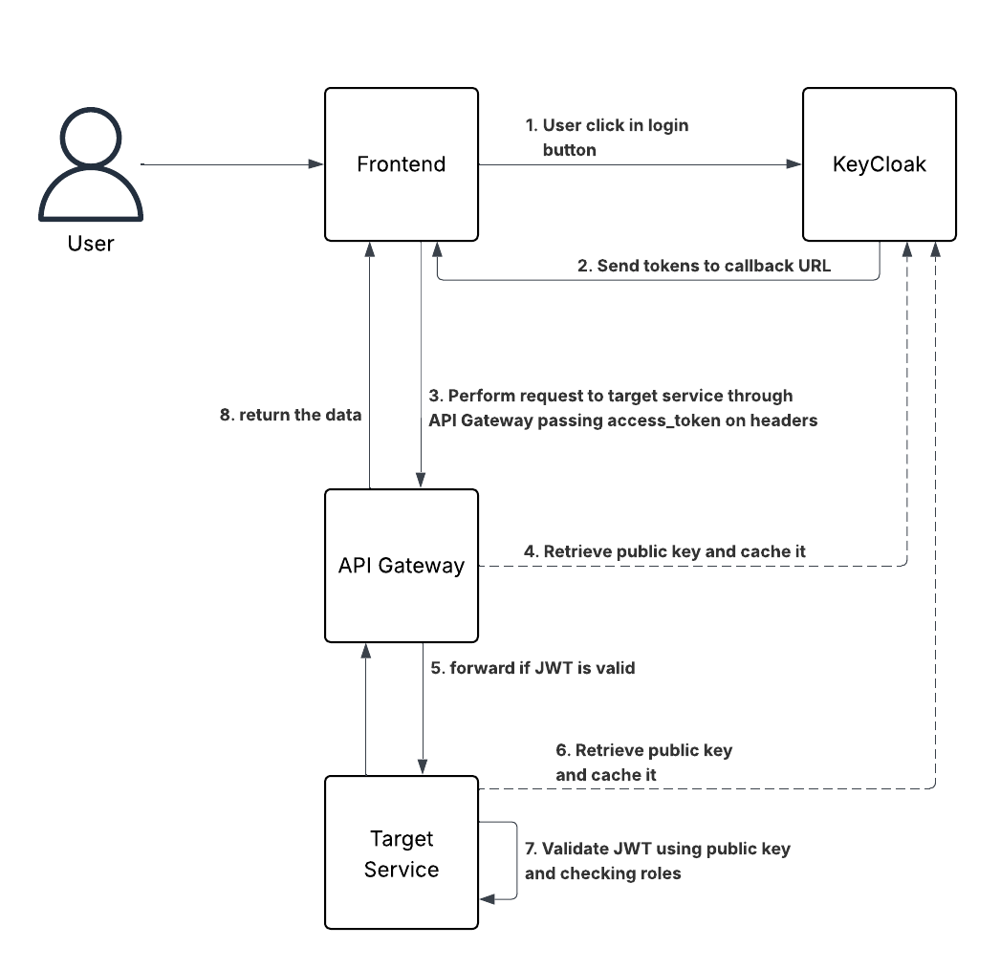

# 🧬 02.MAR.2026 - ARCHITECTURE KATA

## Objective

You must design a Realtime voting system with the following requirements:

    1. Never loose Data
    2. Be secure and prevent bots and bad actors
    3. Handle 300M users
    4. Handle peak of 250k RPS
    5. Must ensure users vote only once
    6. Should be Realtime

Restrictions:

    • Serverless
    • MongoDB
    • On-Premise, Google Cloude, Azure
    • OpenShift
    • Mainframes
    • Monolith Solutions

## 🏛️ Structure

### 1. 🎯 Problem Statement and Context

What is the problem? What is the context of the problem?

We have to design an architecture for a realtime voting system that will handle millions of users and high peaks of requests per second. We must ensure a smooth experience to the user when voting, each vote is unique and the user can check realtime results. It has to be reliable, scalable, secure, recoverable and auditable.

> **Requirements**:
>
> - We must ensure a smooth experience to the user when voting
> - Each vote must be unique
> - The user can check realtime results.
> - It has to be
>   - reliable
>   - scalable
>   - secure
>   - recoverable
>   - auditable

### 2. 🎯 Goals

```
1. Realtime results - It has to provide realtime results so users can follow it after voting
2. Unique votes - Each user will vote only once
2. Security is a must - we must implement ways of preventing bots, DDoS attacks and secure the web layer
3. Encryption - Encryption at rest and transit
5. Scalability - It has to scale as traffic grows
6. Fraud prevention - There has to be fraud prevention in place preventing bots or internal actors from adding artifitial votes.
7. Auditable - There has to be accessible ways of third-party companies audit the voting results when asked
```

### 3. 🎯 Non-Goals

```
1. Serverless: it has high latency, cold startup, resources and execution time are limited.
2. MongoDB - Due to its eventual consistency characteristic, reading may not be realtime.
3. On-Premisse and other clouds than AWS: AWS is the chosen cloud as it's more reliable and scalable
4. OpenShift - OpenShift is a proprietary solution, prefer K8s or other opensource microservice solution.
5. Mainframe or Monolith solutions - The system will need to automatically scale, quickly and on-demand.
```

### 📐 3. Principles

Design principles we want to follow:

```
1. Low Coupling: We need to watch for coupling all times.
2. Isolation: Resources and environments should be isolated
3. Reliability: The system should be highly-available(99.9%) mainly during peaks
4. Observability: we should expose all key metrics on main features. Sucess and errors counters need to be exposed.
5. Testability: Load testing, unit, integration and E2E tests should be done by engineers all times.
6. Cache efficiency: Should leverage SSD caches and all forms of caches as much as possible.
```

### 🏗️ 4. Overall Diagrams

- 🗂️ 4.1 [Overall](arch.drawio) architecture: Show the big picture, relationship between macro components.
- 🗂️ 4.2 [ Infrastructure diagram](infra.drawio.png): Show the infra in a big picture.
- 🗂️ 4.3 [Cache layer diagram](cache-layer.drawio): Show cache architecture
- 🗂️ 4.4 Use Cases: Make 1 macro use case diagram that list the main capability that needs to be covered.

### 🧭 5. Trade-offs

List the tradeoffs analysis, comparing pros and cons for each major decision.
Before you need list all your major decisions, them run tradeoffs on than.
example:

#TODO - Add all the decisions we made

Major Decisions:

```

```

Tradeoffs:

```
1. React Native vs (Flutter and Native)
2. Serverless vs Microservices
3. Redis vs Enbeded Caches
```

### 5.1 Backend

#### 5.1.1 Go (Golang)

```
PROS (+)
  * Fast execution and compilation, simple and efficient concurrency through goroutines and channels, mature ecosystem with extensive libraries, easy deployment via compiled binaries, excellent tooling and IDE support.

CONS (+)
  * Garbage collector can introduce occasional microsecond-level pauses under heavy load.
```

#### 5.1.2 Rust

```
PROS (+)
  * Maximum performance with zero-cost abstractions, memory safety without garbage collection, deterministic performance for ultra-low-latency requirements, strong type system catches errors at compile time, no runtime overhead.

CONS (+)
  * Longer compile times compared to Go. Smaller ecosystem compared to established languages.
```

#### 5.1.3 Java / Kotlin

```
PROS (+)
  * Mature ecosystem, gret integration for Kafka Streams (unmatched for stateful stream processing), robust JVM with advanced JIT compilation, Spring framework for quick development.

CONS (+)
  * GC tuning complexity at scale, higher memory footprint, slower startup times, unpredictable latency spikes during GC pauses, which is unacceptable for real-time voting where every millisecond matters.
```

### 5.2 Websocket, SSE and Polling

#### 5.2.1 Websocket

A full-duplex, persisnt connection where client can push data at any time.

```
PROS (+)

- Real-time, bidirectional communication.
- Minimal overhead after connection is established.
- High throughput, good for chat apps, multiplayer games, collaborative editors.
- Works well for many messages per second.

CONS (+)
  * More complex to implement than other.
  * Not ideal for simple one-way updates.
  * Not supported by older proxies without WebSocket upgrades.
```

#### 5.2.2 Server-Sent Events (SSE)

A single long-lived http connection where server pushes updates.  
Unidirectional (client cannot send messages back over the same channel).

```
PROS (+)

- Very simple to implement (just a text stream from server).
- Auto-reconnect built into the browser EventSource.
- Uses regular HTTP-proxy-friendly.
- Lightweight for one-direction real-time feeds.

CONS (+)
  * Not bidirectional.
  * Not ideal for very high-frequency updates.
  * Limited browser support on some older/embedded environments.
  * No binary data (text only unless you encode).
```

#### 5.2.3 Polling

Client periodically requests new data with repeated HTTP requests.

```
PROS (+)

- Easiest to implement.
- Works everywhere, no special protocols.
- Good for low-frequency or low-priority updates.

CONS (+)
  * Inefficient: many requests with no data = waste.
  * Higher latency between updates (depends on poll interval).
  * Scales poorly (many clients -> many HTTP requests).
```

### 5.4 Frontend:

#### 5.4.1 Solid.js

```
PROS (+)
  * Fine-grained reactivity: It is a pattern that update only the exact piece of the UI that depends on the changed data, without re-rerender the component, it is great for real time projects.
  * Very low runtime overhead: Solid uses almost no framework code in the browser.
  * Very recommended for high-frequency updates.

CONS (+)
  * Small ecosystem: Maybe it can't have some integrations and libraries.
```

#### 5.4.2 Svelte

```
PROS (+)
  * Fast and lightweight output: Compile the code to pure JavaScript without a virtual DOM, producing very small bundles.
  * Built-in reactivity: The UI automatically updates when data changes. Without state libraries.
  * Smaller bundle size, specially for less complex apps.

CONS (+)
  * Small ecosystem: Maybe it can't have some integrations and libraries.
  * Has a great way to update the DOM, better than Virtual DOM, but not so performatic than Solid.js.
```

#### 5.4.3 React

```
PROS (+)
  * Because of its large number of clients has a mature ecosystem.
  * Very stable and enterprise acceptance.

CONS (+)
  * Uses Virtual DOM, which adds overhead on every update.
  * Has a bundle size bigger than the others.
```

#### 5.4.4 Next.js

```
PROS (+)
  * Based on React.js = almost the same community.
  * Great resources for complex scenarios around the full-stack development.
  * Strong ecosystem and enterprise adoption.

CONS (+)
  * For not complex projects, it may be not necessary because its native resources that won't be used.
  * Bundle size bigger than the others.
  * It is default SSR, which is not required for our scenario.
```


### 5.5 Authentication Provider

#### Auth0

PROS (+)

- managed service, it reduces the infrastructure complexidade and maintainance
- security patching automated
- average SLA 99.99%


CONS (-)
- High pricing model, in the site the show cost calculation until 10.000 MAU (monthly active users) and it costs 17,600k dollares yearly. Above it they provide a sales team contact.
- Dependency from a external service for a critical path from the system.
- It also a SPOF

#### KeyCloak

PROS (+)

- More control over the application
- "Free", we will not have monthly costs related a service provide BUT we will have costs from infrasture (AWS) and team costs to managed all components.

CONS (-)
- Security patching will be our team responsibility
- Complex architecture for horizontal scaling: offload session to infinitspan, JVM tunning, Database setup, Load balancer, ...
  
Both solutions provides

- MFA support
- Reset password flows


### Authentication Flow

The user clicks the authentication button and is redirected to the login screen managed by Keycloak.

After Keycloak authenticates the user, an access_token containing the user’s roles will be sent to a callback URL.

Every request made by the frontend will pass through the API Gateway, which will validate the JWT. To do this, it will query the IdP to retrieve the public key, and with it validate the token and its signature. Once authorization is completed, the request will be forwarded to the target service.
The target service will have a filter/middleware that intercepts requests, extracts the access_token from the headers, queries Keycloak’s public key, and validates the token. For performance reasons, the public key may be cached locally for a short period of time.



Drivers:

- We need to have a simple authorization system, so roles will be sufficient.
- Token validation at the edge level will protect us from receiving requests that are not authenticated.
- Token validation in the target service is important because it prevents any kind of bypass and reinforces that the service will only process authorized users.
- Frequent retrieval of the public key from Keycloak is a challenge; to address this, we will add a local cache in the target service.
- In the API Gateway, we will use the JWT Authorizer, which will integrate with the IdP, and we will use a 5-minute cache for the public key.

  

### 🌏 6. For each key major component

What is a majore component? A service, a lambda, a important ui, a generalized approach for all uis, a generazid approach for computing a workload, etc...

```
6.1 - Class Diagram              : classic uml diagram with attributes and methods
6.2 - Contract Documentation     : Operations, Inputs and Outputs
#TODO - Define the api contract
6.3 - Persistence Model          : Diagrams, Table structure, partiotioning, main queries.
#TODO - Define the tables, fields, and interactions between tables; also define some queries (e.g., votes for a given election, results, votes cast by a specific user).


6.4 - Algorithms/Data Structures : Specific algos that need to be used, along size with spesific data structures.
#TODO - If there is any different data structure (a linked list, queue, or something else) to solve a specific use case, it must be added here.
```

Exemplos of other components: Batch jobs, Events, 3rd Party Integrations, Streaming, ML Models, ChatBots, etc...

Recommended Reading: http://diego-pacheco.blogspot.com/2018/05/internal-system-design-forgotten.html

### 🖹 7. Migrations

No migration required in this project

### 🖹 8. Testing strategy

#### 8.1 Unit Tests (Priority: High)

Validate individual functions (vote validation, deduplication logic)

##### 8.1.1 Tools

- Frontend: [Solid testing library](https://testing-library.com/docs/solid-testing-library/intro/)
- Backend: Rust's built-in testing tool

##### 8.1.2 When Tests Run

- In continuous integration pipelines;
- Before code push;
- During development;

##### 8.1.3 KPIs and Thresholds

| KPI            | Threshold | Rationale                      |
| -------------- | --------- | ------------------------------ |
| Test pass rate | 100%      | No broken tests merged to main |

##### 8.1.4 Most Important Features

- Unique voter enforcement - Each user votes only once
- Vote count accuracy - No lost or duplicate votes

#### 8.2 Integration Tests (Priority: High)

Test Redis/PostgreSQL interactions, queue processing

##### 8.2.1 Tools

- Backend: [testcontainers-rs](https://github.com/testcontainers/testcontainers-rs) - Spin up real Redis and PostgreSQL instances in Docker for testing
- Redis: [redis-rs](https://github.com/redis-rs/redis-rs) with `tokio` async runtime for Redis integration tests
- Database: [sqlx](https://github.com/launchbadge/sqlx) with `#[sqlx::test]` macro for automatic test database setup and transaction rollback
- HTTP: [axum-test](https://crates.io/crates/axum-test) or [actix-rt](https://crates.io/crates/actix-rt) test utilities for API endpoint testing

##### 8.2.2 When Tests Run

- In continuous integration pipelines (on every PR);
- Before deployment to staging/production environments;
- After infrastructure configuration changes;
- Nightly scheduled runs for extended integration suites;

##### 8.2.3 KPIs and Thresholds

| KPI                        | Threshold | Rationale                                                       |
| -------------------------- | --------- | --------------------------------------------------------------- |
| Test pass rate             | 100%      | No broken integration tests merged to main                      |
| Redis operation latency    | < 10ms    | Cache operations must remain fast under test conditions         |
| Database transaction time  | < 100ms   | Ensures queries are optimized and indexes are properly used     |
| Concurrent vote accuracy   | 100%      | Zero lost or duplicate votes under concurrent test scenarios    |

##### 8.2.4 Most Important Features

- Concurrent vote processing - Race condition handling
- Redis failover behavior - Fallback to in-memory
- PostgreSQL transaction integrity - ACID compliance for vote persistence
- Redis-to-database consistency - Cached counts match persisted data after sync
- Queue processing reliability - No vote loss during processor restarts
- Lua script atomicity - Verify `USER_ALREADY_VOTED` check prevents duplicates under load

#### 8.3 Load Tests (Priority: High)

Verify 250k RPS handling

##### 8.3.1 Tools

- [k6](https://k6.io/) - Modern load testing tool with JavaScript scripting

##### 8.3.2 When Tests Run

- Before major releases to production;
- After performance-related code changes;
- Weekly scheduled runs in staging environment;
- After infrastructure scaling changes;

##### 8.3.3 KPIs and Thresholds

| KPI                    | Threshold    | Rationale                                                    |
| ---------------------- | ------------ | ------------------------------------------------------------ |
| Throughput             | ≥ 250k RPS   | Must handle peak load requirement                            |
| Response time (p50)    | < 50ms       | Median response must feel instant                            |
| Response time (p95)    | < 200ms      | 95th percentile within acceptable latency                    |
| Response time (p99)    | < 500ms      | Tail latency must not exceed half a second                   |
| Error rate             | < 0.1%       | Less than 1 in 1000 requests should fail under load          |
| CPU utilization        | < 80%        | Headroom for traffic spikes                                  |
| Memory utilization     | < 85%        | Prevent OOM conditions during sustained load                 |

##### 8.3.4 Most Important Features

- System throughput under peak load
- Response time percentiles (p50, p95, p99)
- Vote submission endpoint under concurrent load
- WebSocket connection scaling to 300M users
- Redis atomic operations performance under contention
- Database write throughput for vote persistence

#### 8.4 Contract/API Tests (Priority: Medium)

Validate HTTP endpoints, request/response schemas

##### 8.4.1 Tools

- [utoipa](https://github.com/juhaku/utoipa) - Auto-generate OpenAPI spec from Rust code
- [Prism](https://stoplight.io/open-source/prism) - Stoplight's OpenAPI mock server and contract validator

##### 8.4.2 When Tests Run

- On every pull request affecting API endpoints;
- Before deploying new API versions;
- When API consumers update their contract expectations;
- As part of CI pipeline for both provider and consumer services;

##### 8.4.3 KPIs and Thresholds

| KPI                          | Threshold | Rationale                                                    |
| ---------------------------- | --------- | ------------------------------------------------------------ |
| Contract test pass rate      | 100%      | All API contracts must be honored                            |
| Schema validation coverage   | 100%      | All endpoints must have documented and validated schemas     |
| Breaking change detection    | 0         | No unintentional breaking changes deployed                   |
| API response time (contract) | < 100ms   | Contract tests should validate acceptable response times     |

##### 8.4.4 Most Important Features

- API input validation - Malformed requests rejected with proper error responses
- Response schema compliance - All responses match documented OpenAPI spec
- Vote submission contract - Request/response format for POST /polls/{id}/vote
- Poll results contract - Real-time results endpoint schema validation
- Error response consistency - Standardized error format across all endpoints
- Authentication header validation - Proper handling of missing/invalid tokens

#### 8.5 Chaos Engineering (Priority: Medium)

Failure injection (Redis down, DB failover, network partitions)

##### 8.5.1 Tools

- [Chaos Monkey](https://netflix.github.io/chaosmonkey/) - Netflix's tool for randomly terminating instances in production to ensure resilience

##### 8.5.2 When Tests Run

- Weekly scheduled runs in staging environment;
- Before major releases to production;
- After significant infrastructure changes (scaling policies, new regions);

##### 8.5.3 KPIs and Thresholds

| KPI                              | Threshold   | Rationale                                                              |
| -------------------------------- | ----------- | ---------------------------------------------------------------------- |
| Recovery Time Objective (RTO)    | < 30s       | System must recover from component failure within 30 seconds           |
| Vote loss during failure         | 0           | No votes lost even during Redis/DB failures (queued and retried)       |
| Error rate during degradation    | < 5%        | Graceful degradation must keep most requests successful                |
| Fallback activation time         | < 5s        | In-memory fallback must activate quickly when Redis is unavailable     |
| Data consistency after recovery  | 100%        | Vote counts must reconcile correctly after component recovery          |
| WebSocket reconnection success   | > 99%       | Clients must automatically reconnect after network disruptions         |

##### 8.5.4 Most Important Features

- Redis cluster failover - Verify automatic failover to replica and vote processing continuity
- PostgreSQL RDS failover - Test Multi-AZ failover with zero vote data loss
- Network partition handling - Ensure split-brain scenarios don't cause duplicate votes
- Vote processor queue recovery - Validate in-flight votes are not lost during processor restart
- In-memory fallback activation - Confirm system switches to memory store when Redis is unreachable
- WebSocket connection resilience - Test client reconnection and state recovery after network drops
- Cascading failure prevention - Ensure circuit breakers prevent total system collapse

##### 8.5.5 Experiment Scenarios

| Scenario                     | Injection Method                          | Expected Behavior                                      |
| ---------------------------- | ----------------------------------------- | ------------------------------------------------------ |
| Random instance termination  | Chaos Monkey: terminate random EC2/pod    | Auto-scaling replaces instance, no vote loss           |
| Redis primary failure        | Chaos Monkey: terminate Redis primary     | Automatic failover to replica, < 30s recovery          |
| Vote processor instance kill | Chaos Monkey: kill 50% of processor nodes | Remaining nodes handle load, auto-scaling kicks in     |
| Full availability zone outage| Chaos Monkey: simulate AZ failure         | Traffic routes to healthy AZ, votes continue processing|

#### 8.6 Property-Based Tests (Priority: Medium)

Verify invariants (vote count = unique voters)

##### 8.6.1 Tools

- [proptest](https://github.com/proptest-rs/proptest) - Powerful property-based testing with automatic shrinking and custom strategies

##### 8.6.2 When Tests Run

- On every pull request affecting core voting logic;
- Nightly extended runs with higher iteration counts;
- Before major releases;

##### 8.6.3 KPIs and Thresholds

| KPI                     | Threshold | Rationale                                        |
| ----------------------- | --------- | ------------------------------------------------ |
| Property test pass rate | 100%      | All invariants must hold under randomized input  |
| Iterations per property | ≥ 1,000   | Sufficient coverage of input space               |

##### 8.6.4 Most Important Features

- Vote count invariant - total votes equals count of unique voters
- Idempotency - duplicate vote submissions don't change state
- Vote uniqueness - each user can only vote once per poll

### 🖹 9. Observability strategy

The goal is to know what the system is doing at all times: how fast, how many errors, where it's slow, and why. We split this into four areas: metrics, logs, traces, and profiling.

**Stack**
**Metrics**: Prometheus for time-series metrics collection.
**Visualization**: Grafana for dashboards and alerting UI.
**Logs**: Loki for log aggregation with native Grafana integration.
**Tracing**: Tempo for distributed tracing with S3 storage.
**Profiling**: Grafana Pyroscope for continuous performance analysis.
**Instrumentation**: OpenTelemetry SDK on every service

#### 9.1 Principles

- Every service exposes metrics, logs, and traces. No exceptions.
- Logs always include `trace_id` and `span_id` so you can jump from a log line straight to the full trace.
- Never put `user_id`, `session_id`, or any high-cardinality field as a Prometheus label — it kills performance at this scale. Those go into logs and trace attributes instead.
- Vote counts are pre-aggregated before hitting Prometheus (one counter increment per batch, not per vote).

#### 9.2 Key Metrics

**Voting pipeline**
- `votes_cast_total` by status: `success`, `duplicate`, `fraud_rejected`
- `vote_processing_duration_seconds` — p50, p95, p99
- `kafka_consumer_lag` on the vote-events topic
- `flink_job_processing_latency_seconds` — end-to-end latency through Flink aggregation jobs

**WebSocket / Realtime**
- `websocket_connections_active` — total live connections
- `realtime_update_lag_seconds` — time from vote accepted to result broadcasted (target: p99 < 200ms)
- `websocket_disconnects_total` by reason

**Infrastructure**
- Kafka Streams: consumer lag per partition, state store size, stream thread utilization
- Apache Flink: checkpoint duration, restart count, backpressure ratio per operator
- PostgreSQL: active connections, replication lag, slow query count
- Kafka: consumer lag per partition, under-replicated partitions

**Traffic**
- Requests per second per service
- Error rate per service
- HTTP latency p95/p99 per route

#### 9.3 Logging

All services log structured JSON to stdout. The OTel Collector ships them to Loki.

- Vote accepted
- Duplicate vote rejected
- Fraud signal triggered
- Kafka or Flink error
- WebSocket connect / disconnect
- Auth failure

**Never log:** raw `user_id` in the log body, raw IP addresses, vote content beyond `option_id`, secrets or tokens.

**Retention:** 7 days in Loki (hot), 30 days in S3 (cold). Security/fraud logs: 1 year.

#### 9.4 Dashboards

Four dashboards, each focused on a specific audience:

**System Overview**
- Current RPS vs. 250k capacity limit
- Error rate per service (last 5 min)
- Kafka consumer lag
- Active WebSocket connections
- Top-line vote success rate

**Voting Pipeline**
- Votes/sec over time
- Success vs. duplicate vs. fraud breakdown (stacked)
- Flink aggregation job latency p99
- Kafka Streams consumer lag on vote-events
- DB write latency with a 50ms warning line

**Infrastructure**
- Kafka Streams: consumer lag, state store size, thread utilization
- Apache Flink: checkpoint duration, operator backpressure, job restarts
- PostgreSQL connections, replication lag, slow queries
- Kafka broker health, under-replicated partitions

**War Room**
- 15-second auto-refresh
- Current RPS, error rate (last 60s), Kafka lag, Flink job status, WebSocket connections
- Last 10 alerts fired

#### 9.5 Alerts

Two levels: **Warning** (something is degrading) and **Critical** (SLO breach, wake someone up).

- Vote success rate < 99.9% for 5m / Vote success rate < 99.5% for 2m
- Kafka consumer lag > 10k for 5m / Kafka consumer lag > 50k for 3m
- result_propagation p99 > 200ms for 5m / result_propagation p99 > 500ms for 3m
- Flink checkpoint duration > 30s / Flink job restarts > 3 in 10m
- Kafka Streams backpressure ratio > 50% for 5m
- PostgreSQL replication lag > 10s
- Inbound RPS drops > 80% vs. baseline

Rules:
- No alert fires in under 2 minutes — avoids noise from transient spikes.
- Every alert has a runbook rule pointing to what to do.
- Schedule silence windows for planned maintenance.
- Unanswered critical alerts auto-escalate after 10 minutes.

#### 9.6 Distributed Tracing

We sample 1% of normal successful requests. We capture 100% of requests that hit an error or exceed the p99 latency threshold.

Trace covers the full path: `API Gateway → Voting Service → Kafka → Kafka Streams → Apache Flink → Result Aggregator → WebSocket broadcast`.

### 🖹 10. Data Store Designs

For each different kind of data store i.e (Postgres, Memcached, Elasticache, S3, Neo4J etc...) describe the schemas, what would be stored there and why, main queries, expectations on performance. Diagrams are welcome but you really need some dictionaries.

- Queries examples, per service?
- Partitioning ?
- Caching ?

#### 10.1 VotingCastService
DTO (Data transfer object) received by Service from WS
```rust
impl PollId {
    pub fn new(value: String) -> Result<Self, &'static str> {
        if value.trim().is_empty() {
            return Err("poll_id cannot be empty");
        }
        Ok(Self(value))
    }
}

impl OptionId {
    pub fn new(value: String) -> Result<Self, &'static str> {
        if value.trim().is_empty() {
            return Err("option_id cannot be empty");
        }
        Ok(Self(value))
    }
}

pub struct VoteRequestDTO {
    pub poll_id: PollId,
    pub option_ids: Vec<OptionId>,
}
```

Avro to publish on Kafka `user-voted` topic
```json
{
  "type": "record",
  "name": "VoteCastEvent",
  "namespace": "<project_namespace>.voting",
  "doc": "Event emitted when a user casts a vote in a poll",
  "fields": [
    {
      "name": "event_id",
      "type": "string",
      "logicalType": "uuid",
      "doc": "Unique identifier for idempotency"
    },
    {
      "name": "occurred_at",
      "type": {
        "type": "long",
        "logicalType": "timestamp-millis"
      },
      "doc": "Event timestamp in milliseconds"
    },
    {
      "name": "user_id",
      "type": "string",
      "logicalType": "uuid",
      "doc": "Identifier of the user who cast the vote"
    },
    {
      "name": "poll_id",
      "type": "string",
      "logicalType": "uuid",
      "doc": "Identifier of the poll"
    },
    {
      "name": "option_ids",
      "type": {
        "type": "array",
        "items": {
          "type": "string",
          "logicalType": "uuid"
        }
      },
      "doc": "List of option identifiers selected in the poll"
    }
  ]
}
```

#### 10.3 VotingInvestionService
Avro to receive the event from Kafka `user-voted` topic
```
Should use the same Avro defined in the VotingCastService
```

Convert the Avro to Domain
```rust
pub struct Vote {
    pub user_id: String,
    pub poll_id: String,
    pub option_ids: Vec<String>,
    pub event_id: String,
    pub occurred_at: i64,
    pub created_at: i64,
}
```

Save the domain into the `VotingDB` PostgreSQL database
```sql
CREATE TABLE voted_poll (
    id BIGSERIAL PRIMARY KEY,
    event_id UUID NOT NULL UNIQUE,
    user_id UUID NOT NULL,
    poll_id UUID NOT NULL,
    occurred_at TIMESTAMPTZ NOT NULL,
    created_at TIMESTAMPTZ NOT NULL DEFAULT NOW()
);

CREATE TABLE voted_option (
    voted_poll_id BIGINT NOT NULL REFERENCES voted_poll(id) ON DELETE CASCADE,
    poll_id UUID NOT NULL,
    user_id UUID NOT NULL,
    option_id UUID NOT NULL,
    PRIMARY KEY (user_id, poll_id, option_id)
);

CREATE INDEX idx_voted_poll_poll_id ON voted_poll(poll_id);
CREATE INDEX idx_voted_poll_occurred_at ON voted_poll(occurred_at);
CREATE INDEX idx_voted_poll_option_option_id ON voted_option(option_id);
```

#### 10.4 Apache Flink (Aggregation layer) - Using FLINK SQL
##### 10.4.1 Defining Kafka topics that Flink needs to connect (source/sink)
Defining a continuous streaming pipeline source
```sql
CREATE TABLE votes_raw (
    event_id STRING,
    user_id STRING,
    poll_id STRING,
    option_ids ARRAY<STRING>,
    occurred_at TIMESTAMP(3),
) WITH (
    'connector' = 'kafka',
    'topic' = 'user-voted',
    'properties.bootstrap.servers' = '<connection_url>',
    'format' = 'avro',
    'scan.startup.mode' = 'group-offsets'
    /* group-offsets means, start reading from the offsets already committed for this consumer group or continue from where I left off. */
);

CREATE VIEW deduplicated_events AS
SELECT *
FROM (
    SELECT *,
        ROW_NUMBER() OVER (
            PARTITION BY event_id
            ORDER BY occurred_at ASC
        ) AS row_num
    FROM votes_raw
)
WHERE row_num = 1;

CREATE VIEW exploded_votes AS
SELECT
    user_id,
    poll_id,
    option_id,
    occurred_at
FROM deduplicated_events
CROSS JOIN UNNEST(option_ids) AS t(option_id);

CREATE VIEW business_deduplicated_votes AS
SELECT *
FROM (
    SELECT *,
        ROW_NUMBER() OVER (
            PARTITION BY user_id, poll_id, option_id
            ORDER BY occurred_at ASC
        ) AS row_num
    FROM exploded_votes
)
WHERE row_num = 1;
```

Defining a continuous streaming pipeline sink
```sql
CREATE TABLE vote_counts (
    poll_id STRING,
    option_id STRING,
    vote_count BIGINT,
    updated_at TIMESTAMP(3),
    PRIMARY KEY (poll_id, option_id) NOT ENFORCED
) WITH (
    'connector' = 'kafka',
    'topic' = 'votes-computed',
    'properties.bootstrap.servers' = '<connection_url',
    'format' = 'avro'
);
```

#### 10.4.2 Defining Flink SQL aggression to count votes to be sent to the Kafka sink topic.
Configuration to process bath in 1 minute
```sql
SET 'table.exec.mini-batch.enabled' = 'true';
SET 'table.exec.mini-batch.allow-latency' = '1 min';
SET 'table.exec.mini-batch.size' = '5000';
```

Starts a continuous streaming job, the job runs forever (until you stop it).
```sql
INSERT INTO vote_counts
SELECT
    poll_id,
    option_id,
    COUNT(*) AS vote_count,
    CURRENT_TIMESTAMP AS updated_at
FROM business_deduplicated_votes
GROUP BY
    poll_id,
    option_id;
```

#### 10.4.3 VotingScoreService 
Avro to receive the event from Kafka `votes-computed` topic
```json
{
  "type": "record",
  "name": "VoteCountComputedEvent",
  "namespace": "<project_namespace>.voting",
  "doc": "Aggregated vote count per option for a poll within a time window",
  "fields": [
    {
      "name": "poll_id",
      "type": "string",
      "doc": "Identifier of the poll",
      "logicalType": "uuid"
    },
    {
      "name": "option_id",
      "type": "string",
      "doc": "Identifier of the option",
      "logicalType": "uuid"
    },
    {
      "name": "vote_count",
      "type": "long",
      "doc": "Number of votes for this option within the window"
    },
    {
      "name": "updated_at",
      "type": { 
        "type": "long", 
        "logicalType": "timestamp-millis"
      },
      "doc": "Last time that the count was updated"
    }
  ]
}
```

Table to save into `VotingScoreBD` PostgreSQLDB
```sql
CREATE TABLE poll_option_score (
    poll_id UUID NOT NULL,
    option_id UUID NOT NULL,
    vote_count BIGINT NOT NULL,
    updated_at TIMESTAMPTZ NOT NULL,
    PRIMARY KEY (poll_id, option_id)
);

CREATE INDEX idx_poll_option_score_poll_id ON poll_option_score(poll_id);
CREATE INDEX idx_poll_option_score_option_id ON poll_option_score(opttion_id);
```

Domain to use to save into DB
```rust
pub struct PollOptionScore {
    pub poll_id: String,
    pub option_id: String,
    pub vote_count: i64,
    pub updated_at: i64,
}
```

Select to create DTO to response WS
```sql
SELECT option_id, vote_count, updated_at
FROM poll_option_score
WHERE poll_id = $1;
```

DTO to response WS
```rust
pub struct PollScoreResponseDTO {
    pub poll_id: String,
    pub total_votes: i64,
    pub options: Vec<OptionScoreDTO>,
    pub updated_at: i64,
}

pub struct OptionScoreDTO {
    pub option_id: String,
    pub vote_count: i64
}
```

UPSERT to save into DB
```sql
INSERT INTO poll_option_score (poll_id, option_id, vote_count, updated_at)
VALUES ($1, $2, $3, $4)
ON CONFLICT (poll_id, option_id)
DO UPDATE SET
    vote_count = EXCLUDED.vote_count,
    updated_at = EXCLUDED.updated_at;
```

### 🖹 11. Technology Stack

#### 11.1 Backend:

**Go** has a lightweight concurrency model, powered by goroutines and channels, that enables massive parallel request handling without the overhead of traditional threading models, serving as a perfect choice for our distributed system. This choice will grant lower latency and smaller memory footprint, which is critical for high-RPS microservices. It also provides excellent built-in networking libraries, simplifying the development of HTTP, WebSocket, and gRPC services. The compiler produces single, statically linked binaries that streamline deployment and enable quick startup times for horizontal scaling. Go also benefits from a mature ecosystem with robust support for distributed systems technologies like Kafka, Redis, CockroachDB, PostgreSQL, and various distributed caches.

- Frontend:

#### 11.2 Frontend Framework:

Chosen Solid.js because it is the most performatic solution.

Solid.js is a highly performant, lightweight UI library for building reactive interfaces, specially strong in real-time, high-frequency update scenarios. It focuses on fine-grained reactivity, meaning the framework updates only the exact parts of the DOM that depend on changed data.

Why popular frameworks like React and Next was not chosen?

React and Next.js offer a strong ecosystem support, but their features introduce unnecessary overhead for a CSR-only, WebSocket-driven real-time voting system.

<!-- Remove ? -->
<!-- - Infrastructure:
- Data: -->

#### 11.3 - UI Bot prevention

- reCaptcha V3 (Invisible Captcha)
  - Analyzes user interactions in the background without friction and better suitable than challenges that nowadays can be bypassed by AI.
- JS Challenges
  - To ensure the client is a real browser executing JS code, preventing basic bots which do not run JS.

#### 11.4 Websocket

WebSockets are chosen because they are bidirectional, scalable, secure, reliable, and optimized for real-time systems - all critical requirements for a massive voting platform.

WHY:

- Bidirecional communication: Clients must send votes, and the server must confirm them.
- SSE is one-way only (server -> client): WS support full two-way messaging.
- Scalablity: We need to support 300M users and 250k RPS, SSE uses heavy HTTP connections and does not scale well to millions, Websockets are optimized for millions of concurrent connections.
- Lower latency and better performance: WS have lighter frames, less overhead, and better throughput, SSE becomes inefficient at very hight RPS.

### 🖹 12. References

- Architecture Anti-Patterns: https://architecture-antipatterns.tech/
- EIP https://www.enterpriseintegrationpatterns.com/
- SOA Patterns https://patterns.arcitura.com/soa-patterns
- API Patterns https://microservice-api-patterns.org/
- Anti-Patterns https://sourcemaking.com/antipatterns/software-development-antipatterns
- Refactoring Patterns https://sourcemaking.com/refactoring/refactorings
- Database Refactoring Patterns https://databaserefactoring.com/
- Data Modelling Redis https://redis.com/blog/nosql-data-modeling/
- Cloud Patterns https://docs.aws.amazon.com/prescriptive-guidance/latest/cloud-design-patterns/introduction.html
- 12 Factors App https://12factor.net/
- Relational DB Patterns https://www.geeksforgeeks.org/design-patterns-for-relational-databases/
- Rendering Patterns https://www.patterns.dev/vanilla/rendering-patterns/
- REST API Design https://blog.stoplight.io/api-design-patterns-for-rest-web-services
