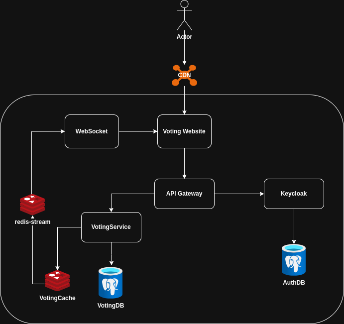
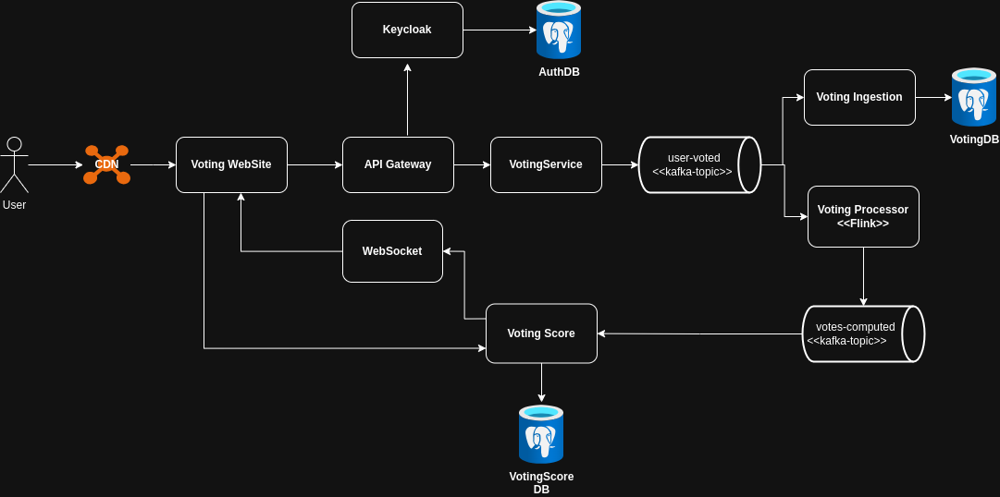
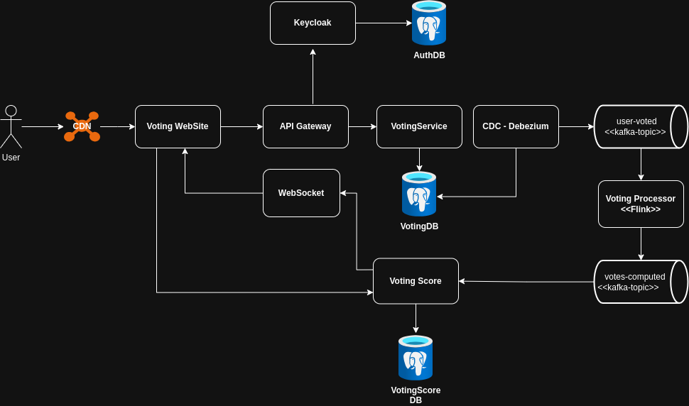

# Trade Off Architecture Analysis

## 1) Redis Centric

Characteristics

- Lua script in Redis to guarantee atomicity and batch control
- Postgres to store the user vote
- The UI will be updated via WebSocket, which will be notified by Redis Stream 

Positive:

- Performance* due to writes happening in Redis
- Atomicity and single-vote guarantee
- Simplicity

Negative:

- Redis as the primary database.
- Risk of data loss
- Need to enable AOF=always which will impact performance
- Possibility of dual-write issues  (Redis -> Postgres)
- Vote computation done synchronously
- Read and write hit the same component

## 2) Event-driven + CQRS

Characteristics

- Writes directly to Kafka
- Asynchronously writes the data using insert+batches in Postgres
- Vote computation done asynchronously
- Separation of writes and reads
- Voting Score is responsible for updating the socket

Positive:

- High write throughput
- Scalability and log-based architecture
- Writes to Postgres, vote computation and WebSocket publishing done asynchronously 
- Backpressure layer for all components
- Reads doesnt affect the writes

Negative:

- Higher number of components in the architecture
- High complexity to guarantee single vote
    - Exactly-once semantics
    - Event deduplication
- Performance penalty to guarantee no data loss
    - Manual ack control
    - Replication factor 3

## 3) Postgres First + CDC

Characteristics

- Write happens first in Postgres (synchronous)
- Debezium processes the WAL and publishes to Kafka
- Dedicated service for result queries
- Voting Score is responsible for updating the socket

Positive:

- Postgres as source of truth
- Simple mechanism to guarantee single vote via database constraint
- Vote computation and WebSocket publishing done asynchronously
- Backpressure layer for all components after the database

Negative:

- High volume of writes in Postgres, without batch possibility
- WAL TTL (high: may cause disk issues, low: may cause data loss in case of Debezium downtime)
- Need to scale the database (Sharding techniques, partition tables)