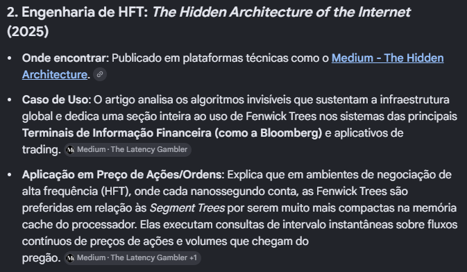

# Green team

tree-based data structures

The core idea behind Fenwick trees is to represent the array of elements using a binary tree structure, where each node stores the cumulative frequency of a specific range of elements.By design, each element within the tree structure is responsible for a range of elements whose width is a power of two. This property enables an efficient representation of the cumulative frequency, making it easy to access the desired range for range queries and element updates.

When to Use It
The Fenwick Tree is ideal when you have a fixed-size array that needs frequent updates and queries. 

## Use Cases

### Stocks prices

A Fenwick Tree é aplicada em finanças para otimizar a contagem de ordens, calcular VWAP dinâmico e somar taxas de corretagem em tempo logarítmico, operando em livros de ofertas e simuladores de alta frequência (HFT). Discussões técnicas abordam a adaptação da árvore para tamanhos dinâmicos e consultas de intervalo, cruciais para cenários de mercado com alta volatilidade. Para detalhes práticos, acesse o repositório HFT-Orderbook GitHub e o guia no Medium.

Fenwick Trees are not used for predicting future stock prices, but they are heavily utilized in the underlying financial engineering software to process rapid real-time order books, transaction feeds, and historical trading data in 

 time.

5 Critical Use Cases in Stock Market Systems
Real-Time Volume-Weighted Average Price [VWAP](https://www.tradersmagazine.com/news/benchmarking-for-the-bear-a-love-and-hate-affair-with-vwap/): Systems must continuously calculate VWAP (Total Dollar Volume / Total Shares Traded) across sliding time windows. A Fenwick Tree tracks dynamic volume and price-volume prefix sums to recalculate VWAP instantly as millions of new trades stream in. 
Order Book Cumulative Depth: Stock exchanges display the "depth" of the market (how many shares are available for purchase up to a certain price level). A Fenwick Tree allows trading software to instantly calculate the total number of shares available across a specific price range 

 even as limit orders are placed and canceled. 
Tick-by-Tick Order Imbalance: High-frequency trading (HFT) algorithms evaluate buying vs. selling pressure. By assigning +1 to buy orders and -1 to sell orders, a Fenwick Tree computes net order imbalance over any customized historical lookback window instantly. 
Dynamic Price Volatility Tracking: Quant platforms use them to maintain running sums of squared price changes over volatile, shifting microsecond intervals to monitor sudden market spikes or flash crashes.
Backtesting Execution Strategies: When testing trading algorithms against historical market data, a Fenwick Tree accelerates range sum queries over massive datasets (e.g., total trading volume during a specific 5-minute interval across 10 years of data).

Traders developing Expert Advisors can also rely on the Fenwick Tree because of its compute speed. It has a readable hierarchical structure. It not only holds data but it natively organizes it by cumulative frequencies. By being able to isolate particular bits within an array's index, the tree is able to create unique topological containers. Once we use it, we are no longer looking at a flat list of 32 volume bars. Instead, we get a structured map for querying and comparing different time and momentum scales. The helper class for this algo is introduced as follows in MQL5:

Atualizar o VWAP dinâmico na memória cache enquanto o preço oscila.

# References

https://medium.com/@kanishks772/the-hidden-architecture-of-the-internet-20-algorithms-that-power-everything-9e0d139a9bd0
https://arxiv.org/html/2304.02356v3
https://medium.com/@francescofranco_39234/fenwick-trees-4310799f68e2 <= esse vai ser bem util para entender a estrutura de dados e como ela funciona
https://cp-algorithms.com/data_structures/fenwick.html <= da pra entender porra nenhuma, pura matemática
https://stackoverflow.com/questions/77217104/simpler-alternatives-to-fenwick-trees
https://www.shadecoder.com/de/topics/what-is-fenwick-tree-bit-a-practical-guide-for-2025
https://www.investopedia.com/terms/b/binomialoptionpricing.asp#toc-applying-the-binomial-option-pricing-model-in-real-trading fala alguma coisa msa não tenho certeza
https://www.mql5.com/en/articles/22558 esse parece trazer coisas interessantes
https://github.com/Crypto-toolbox/HFT-Orderbook
https://quant.stackexchange.com/questions/63140/red-black-trees-for-limit-order-book
https://stackoverflow.com/questions/21995930/dynamic-i-e-variable-size-fenwick-tree
https://medium.com/@0xape/binary-indexed-trees-a-beginner-friendly-visual-guide-15fc1d77cad1
https://ethresear.ch/t/fenwick-bitmap-constant-time-matching-for-on-chain-order-books/22313
https://reports.chainsecurity.com/Pendle/ChainSecurity_Pendle_BorosMarkets_Audit.pdf
https://quant.stackexchange.com/questions/80117/efficiently-tracking-order-queue-position-in-a-limit-order-book-implementation
